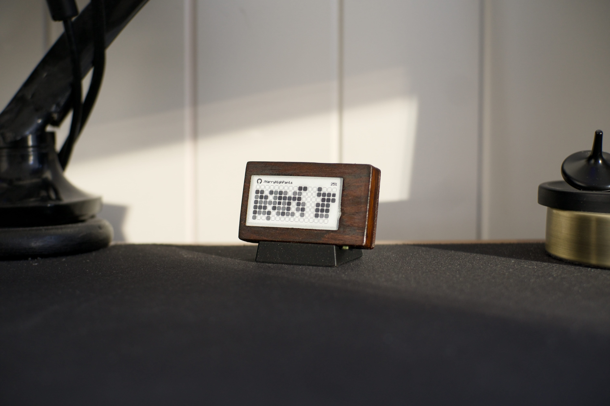
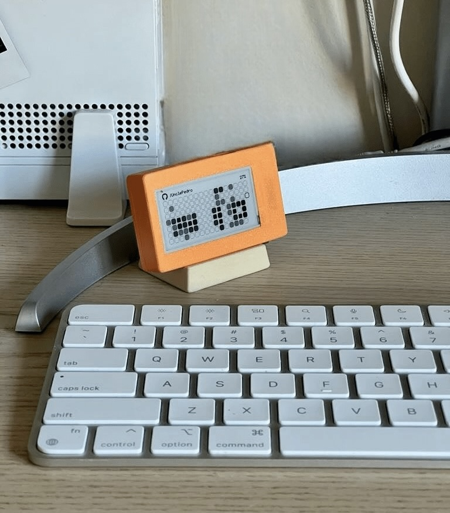
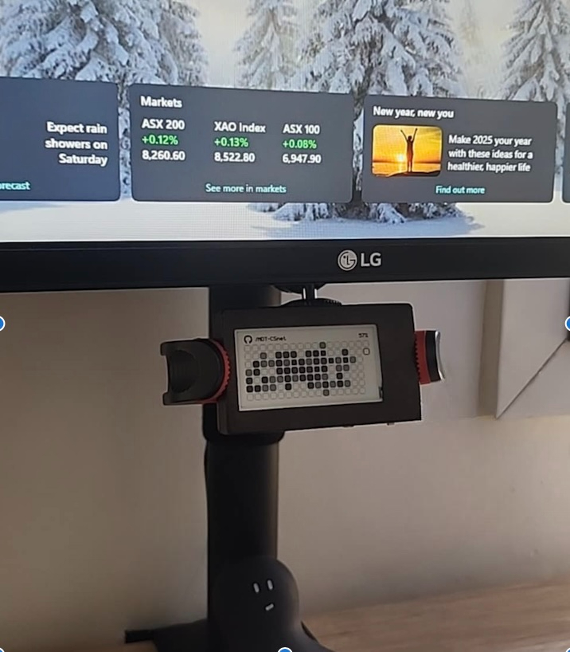
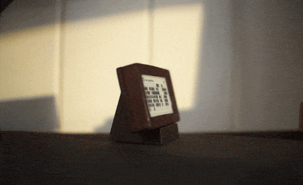
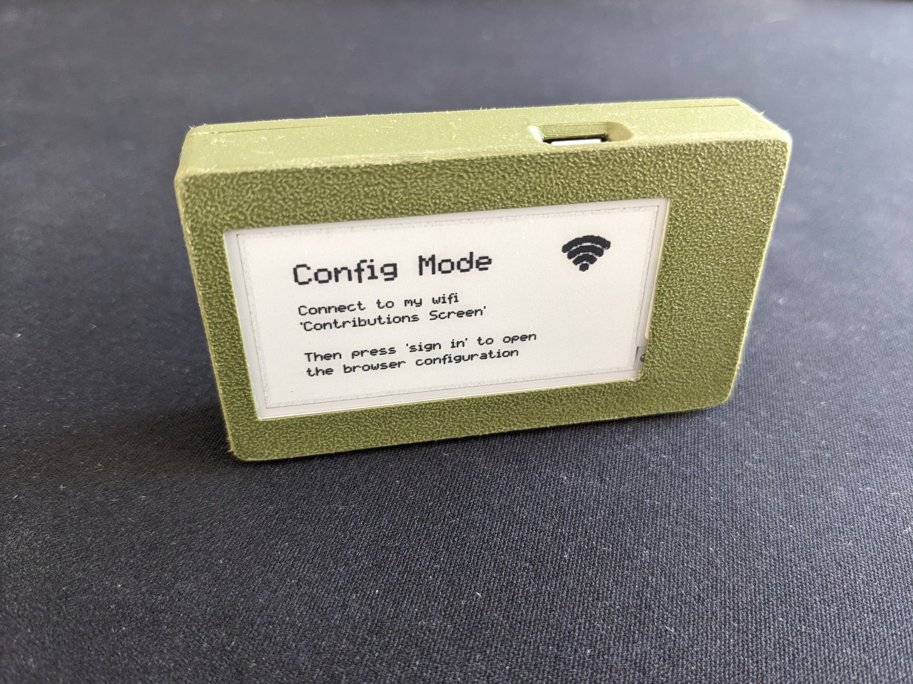
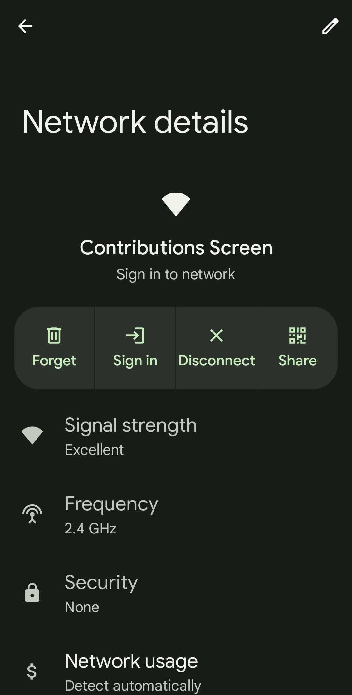
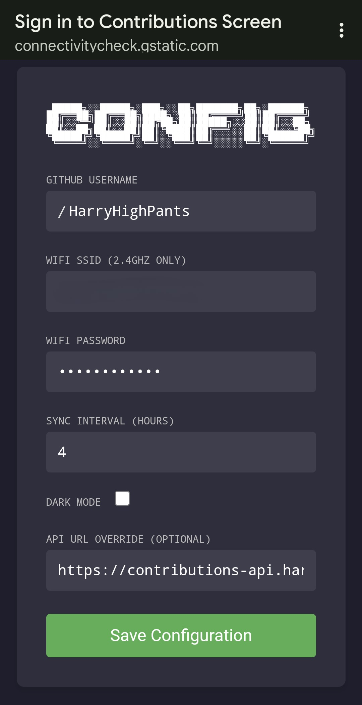
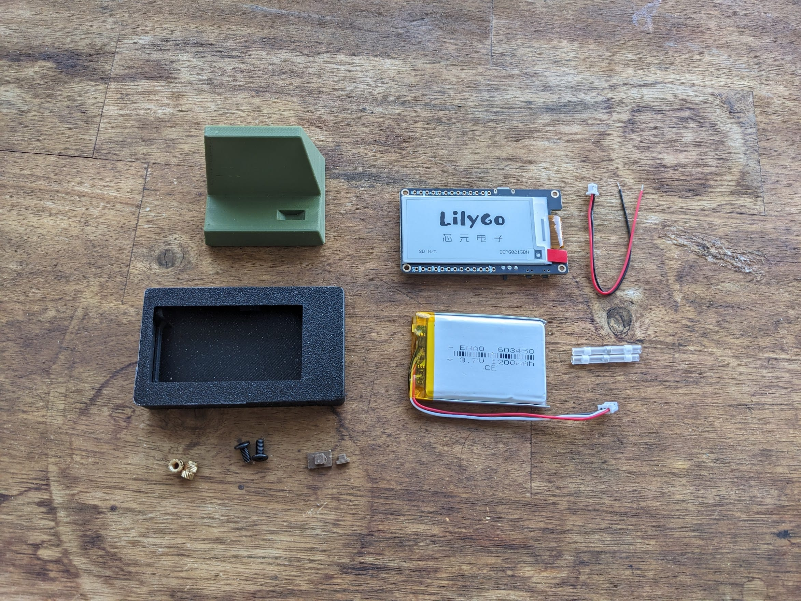
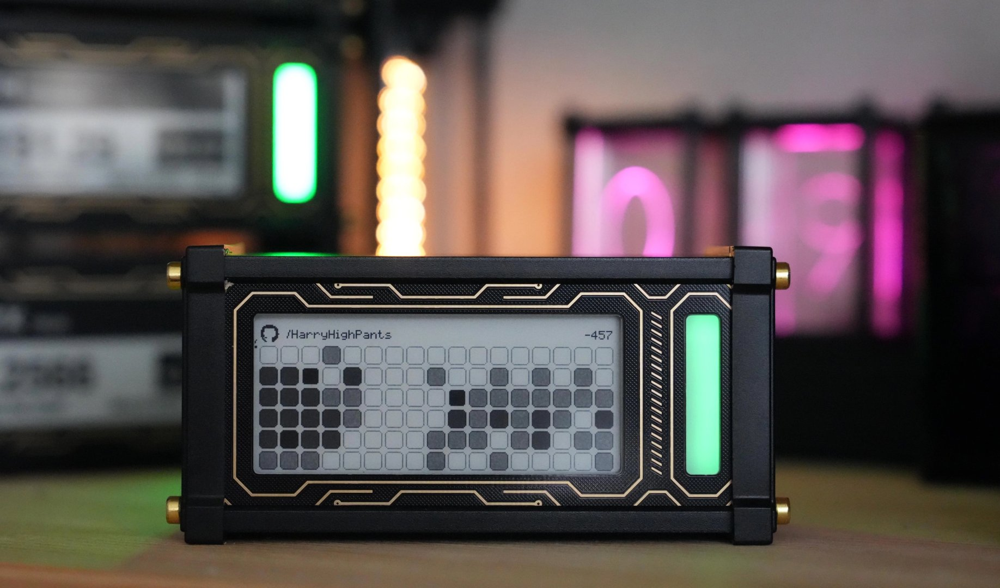

# Git Contributions E-Ink Display

  
<p float="left">
    
   
</p>
  

Show off your commit streaks with this wireless e-ink display. It uses an ESP32 to fetch and display your latest
contributions.

Runs for ~3 months before needing a recharge via micro usb. Default refresh interval is 4hrs which can be configured.
There is also a dark mode setting.

## Contents

- [Configuration](#configuration)
- [Hardware](#hardware)
- [Software](#software)
- [Install](#install)

## Configuration

Hold down the button for 2 seconds to go into wifi configuration mode. This will create a wifi network called 
"Contributions screen"



Once connected with your phone or laptop press "Sign In" to open the browser configuration

<p float="left">
    
    
</p>

After saving your configuration the device will restart with the updated settings

- If there's an issue with the wifi connection you'll get a striked through wifi symbol
- If there's an issue with fetching the commit data from the api then you'll get a striked through link icon

## Hardware



- [LILYGO® T5 2.13inch E-Paper Development Board](https://lilygo.cc/products/t5-v2-3-1)
  - These are normally used as shopping center price displays but also happen to be the perfect dimensions for this 
    project. Shoutout to Lilygo for creating these neat little guys
  - I found the GDEM0213B74 to be a bit sharper than the DEPG0213BN which looked like it had some anti-aliasing built in
    that I couldn't disable
  - This specific board wasn't listed as supported by the greyscale gfx library however using one with similar specs did
    the trick
- 3.7V 1200mAh 603450 battery
  - 50mm x 34mm x 6mm
  - Great size for this project, fits quite snugly. A thinner battery might need something to prevent rattling around 
    like some double sided tape
  - The Lilygo comes with a 1.25mm 2pin JST connector so don't need to worry about finding one with that connector
- 3d printed case and stand available for free on [MakerWorld](https://makerworld.com/en/models/1427537-lilygo-t5-2-13-3d-printed-case#profileId-1483837)

  - Buttons and switch, secured lid with screws, thin screen bezels and a mechanism to keep the screen firmly at the
    front of the case.
  - For the wood style finish I printed with a Bambu Lab wood filament and applied an alcohol ink with a cheap and thick
    paintbrush
  - Other cases available:
    - Thingiverse model by [xl0e](https://www.thingiverse.com/thing:4670205)
    - Lilygo project by [Piotr-Kubica](https://github.com/piotr-kubica/weather-tiny)
    - Or build your own using this Lilygo reference model on [GrabCad](https://grabcad.com/library/lilygo-t5-2-13-1)

- M3 screws, 6mm
- M3 female thread inserts ~5.7mm
  - These are great, just push them into 3d prints with a soldering iron and you've got a perfect thread
- AWG 26-24 Heat shrink wire connectors or solder

The EleksCava creator has had success adapting the code to work with their screen [here](https://www.reddit.com/r/esp32/comments/1kgrwxk/comment/mrbv0fa)


## Software

- Configuration mode
  - When the esp32 wakes up we get a `esp_sleep_get_wakeup_cause` which we can use to determine whether it was due to 
    the button being pressed or the sleep timer. If it was the button we check it again after 2 seconds and if it's
    still `LOW` (pressed) then enter config mode
  - In the [CaptiveConfigServer](./src/CaptiveConfigServer.h) file the esp32 creates it's own wifi access point which
    when connected to uses a captive portal to show a html form. Before sending the html the current configuration
    values are injected into the forms inputs
  - When the user presses save they're navigated to /submit with the entered form values in the search params of the url
  - The esp32 then reads these and stores them in RTC memory before restarting
    - RTC memory persists through `esp_deep_sleep` but not when powered off
- Fetching contribution data
  - In the [ContributionsApi](./src/ContributionsApi.h) file the esp32 first tries to connect to wifi via the provided
    wifi ssid and password
  - Once connected it does an api request to the configured simplified contributions api that returns an integer[] 
    representing the level of commits for each day requested. e.g 2 weeks = `[1, 0, 3, 1, 4, 0, 0, 1, 0, 3, 1, 4, 0, -1, -1]`
    - -1 means the day is later in the week
    - 0 for no commits today
    - 1-4 for the level of commits
  - The custom [github-contributions-api](https://github.com/HarryHighPants/github-contributions-api) is available on 
    Github if you'd like to fork or host your own. It just uses the Github graphql api to fetch the data and then
    transforms it into the simplified integer[] response. It's written in NodeJS and Typescript. Technically this could
    serve as a habit tracker for other events using a different api that follows the same response structure, gym
    session for example
  - The retrieved data is deserialised using deserializeJson (probably overkill) and if it's changed, stored in RTC
    memory and rendered
- Rendering
  - In the [ScreenController](./src/ScreenController.h) file we're utilising the
    [Adafruit GFX Library](https://github.com/adafruit/Adafruit-GFX-Library) with a
    [greyscale e-ink display library](https://github.com/ZinggJM/GxEPD2_4G) to draw the shapes, icons and text
  - The icons were created using a mix of Javls [image2cpp](https://github.com/javl/image2cpp) tool and Cowboys
    [Bitmap code generator](https://bitmap-code-generator.benalman.com/)

## Install

To install the latest precompiled build on your esp32

1. Download the latest zip from the [releases page](https://github.com/HarryHighPants/esp32-git-contributions-epd/releases)
   and unzip it
2. Connect your esp32 to your computer via USB
3. Run `ls /dev/cu.usbserial-*` to find the serial port of your esp32
4. Run `esptool.py --chip esp32 --port <SERIAL_PORT> --baud 115200 write_flash -z 0x1000 bootloader.bin 0x8000 partitions.bin 0x10000 firmware.bin`
   - Where `<SERIAL_PORT>` is the serial port of your esp32from the previous step

## Development

If you'd like to develop the code yourself you can use PlatformIO to build and upload the code to your esp32.

1. Clone this repository
2. Install [PlatformIO](https://platformio.org/install/ide) in your IDE of choice.
3. Open the project in your IDE
4. Connect your esp32 to your computer via USB
5. Run `pio run -t upload` to build and upload the code to your esp32
6. Run `pio device monitor` to see the logs from your esp32
7. Make changes to the code and repeat steps 5 and 6 to see the changes

> [!TIP]
> You should be able to use your IDE's build/run tools to build and flash your esp32 once you have PlatformIO installed.  

### Releasing

To build a new version of the code for release, simply run the following command in the root of the project:

```bash
./bin/build-release-zip.sh
```
